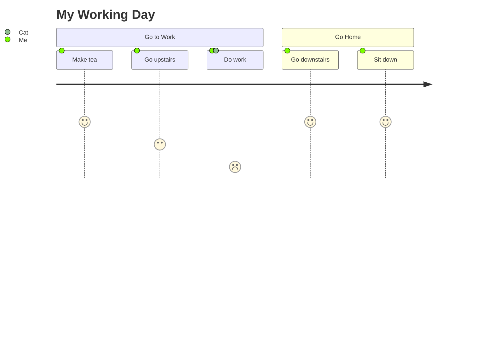
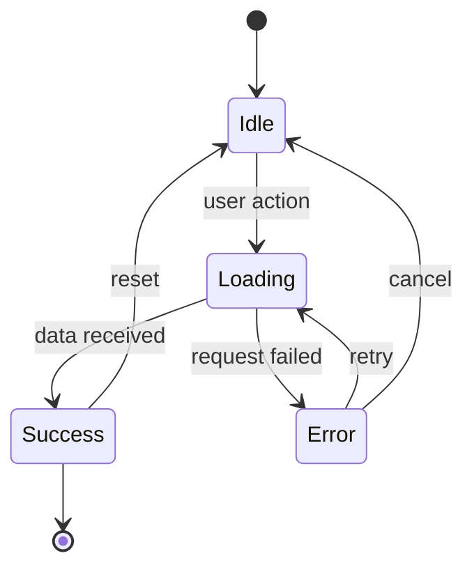
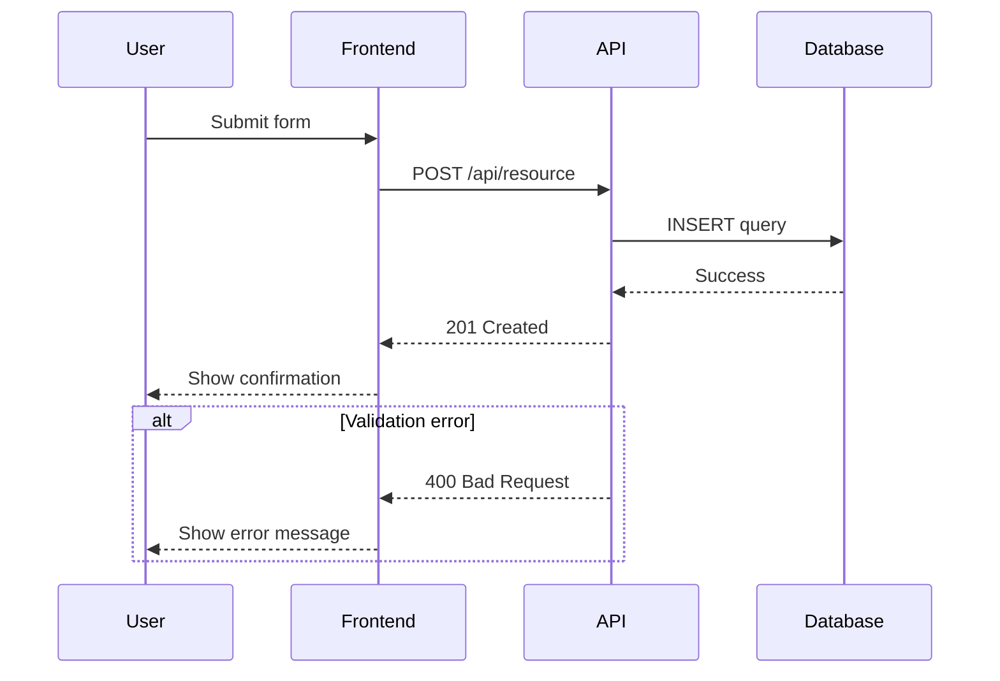

# Framework Patterns Reference

Per-framework analysis guide for the user-flow skill.
For each framework: which files to read, what signals to look for, what to extract.

---

## React SPA

**Files to read (in order):**
1. `src/App.tsx` or `src/App.js` — top-level route structure
2. `src/router/` or `src/routes/` — route definitions
3. Any file importing `react-router-dom`: `BrowserRouter`, `Routes`, `Route`, `useNavigate`, `Navigate`
4. Redux: `src/store/`, `src/slices/`, files with `createSlice` or `useReducer`
5. Context: files with `createContext`, `useContext`

**Extract:**
- Every `<Route path="..." element={<Component />} />` → navigation node
- `useNavigate('/path')` or `<Navigate to="...">` → transition edge
- Auth guards: components that check `isAuthenticated` and redirect → decision diamond
- `useState` with loading/error/success → state diagram states
- `fetch`, `axios.get/post`, `useQuery`, `useMutation` → async/sequence diagram step

**Common patterns:**
```
/ (Home) → /login (auth check) → /dashboard → /profile → /settings
Protected routes wrapped in <PrivateRoute> or <AuthGuard>
Form flows: /checkout/cart → /checkout/shipping → /checkout/payment → /order-confirmation
```

---

## Next.js

**Files to read (in order):**
1. `app/` directory (App Router) or `pages/` directory (Pages Router)
2. `middleware.ts` — auth checks, redirects
3. `app/layout.tsx` — shared UI structure
4. API routes: `app/api/` or `pages/api/`

**Extract:**
- Every directory under `app/` or file under `pages/` (excluding `_app`, `_document`, `api/`) → page node
- `redirect()` or `useRouter().push()` → transition edge
- `middleware.ts` matcher paths → auth decision nodes
- Server Actions (`'use server'`) → async interaction
- `loading.tsx`, `error.tsx` → state nodes

**Common patterns:**
```
/ → /auth/login (middleware) → /dashboard
/products → /products/[id] → /cart → /checkout
API: /api/auth → /api/orders → /api/payments
```

---

## Angular

**Files to read (in order):**
1. `src/app/app-routing.module.ts` or `src/app/app.routes.ts` (standalone)
2. Lazy-loaded module routing files: `feature/feature-routing.module.ts`
3. Guards: files with `CanActivate`, `CanDeactivate`, `CanLoad`
4. Services: files with `HttpClient.get/post` calls
5. NgRx: `store/`, files with `createAction`, `createReducer`, `createEffect`

**Extract:**
- Every `{ path: '...', component: XComponent }` → navigation node
- `canActivate: [AuthGuard]` → auth decision point
- `loadChildren: () => import(...)` → lazy-loaded section boundary
- `router.navigate(['...'])` → transition edge
- NgRx `createEffect` with HTTP call → async/sequence step
- `canDeactivate` guard → "unsaved changes?" decision

**Common patterns:**
```
/login (guard: !authenticated) → /home (guard: authenticated)
/list → /detail/:id → /edit/:id (canDeactivate: unsaved changes)
Lazy-loaded: /admin → AdminModule → /admin/users, /admin/settings
```

---

## Vue 3 + Vue Router

**Files to read (in order):**
1. `src/router/index.ts` or `src/router/index.js`
2. Navigation guards: `router.beforeEach`, `beforeEnter` in route config
3. Pinia stores: `src/stores/` — files with `defineStore`
4. Composables: `src/composables/` — files with `useFetch`, `useQuery`

**Extract:**
- Every `{ path: '...', component: X, name: '...' }` → navigation node
- `router.beforeEach` checking auth → decision diamond
- `router.push('...')` or `<router-link to="...">` → transition edge
- `defineStore` with loading/error state → state diagram
- `fetch`, `axios`, `useFetch` calls → sequence diagram steps

---

## Node.js / Express API

**Files to read (in order):**
1. `app.js` or `server.js` or `src/index.ts` — middleware chain registration
2. `routes/` or `src/routes/` — route handler files
3. `middleware/` — auth, validation, logging middleware
4. `controllers/` — business logic with DB calls

**Extract:**
- `app.use(path, router)` → route group node
- `router.get/post/put/delete(path, handler)` → API endpoint node
- Auth middleware (`passport`, `jwt.verify`, session check) → decision diamond
- `try/catch` with error responses (400, 401, 403, 404, 500) → error paths
- Database calls (`Model.find`, `db.query`, `prisma.X`) → async step in sequence diagram

**Common patterns:**
```
POST /auth/login → validate credentials → issue JWT → 200 | 401
GET /resource → auth middleware → fetch from DB → 200 | 404
POST /resource → validate body → write to DB → emit event → 201 | 400/500
```

---

## SAP Fiori Elements V4

**Files to read (in order):**
1. `webapp/manifest.json` → `sap.ui5.routing` section
2. `webapp/manifest.json` → `sap.app.crossNavigation`
3. `webapp/annotations/` or `srv/*.cds` / `app/*/annotations.cds` — UI annotations

**Extract from manifest.json:**
- `routes[].pattern` → URL pattern (page entry point)
- `routes[].target` → target name
- `targets[name].options.settings.entitySet` → data entity
- `targets[name].name`: `sap.fe.templates.ListReport` → List Report page
- `targets[name].name`: `sap.fe.templates.ObjectPage` → Object Page
- `crossNavigation.outbounds` → external app navigation

**Extract from annotations:**
- `@UI.LineItem` → table columns (user-visible data)
- `@UI.Facets` → Object Page sections
- `@Common.SideEffects` → data-refresh triggers (state transitions)
- `@Core.Immutable`/draft actions → edit flow decision points

**Common patterns:**
```
Start → List Report (filter bar → apply → table results)
      → select row → Object Page (display mode)
      → Edit button → Object Page (edit mode) → Save/Discard
Object Page → subsection navigation via Facets
Cross-navigation: Object Page → external app via intent-based navigation
```

---

## SAP Fiori Elements V2

**Files to read (in order):**
1. `webapp/Component.js` — routing config (often inline)
2. `webapp/manifest.json` → `sap.ui5.routing` (if using manifest routing)
3. `webapp/annotations.xml` or `webapp/localService/SEPMRA_*.xml`

**Extract:**
- `pages` config with `entitySet` and `component` (`sap.suite.ui.generic.template.ListReport`, `ObjectPage`)
- Navigation properties between pages
- `navigationProperty` in ObjectPage config → sub-object navigation
- Worklist (`sap.suite.ui.generic.template.Worklist`) as alternative to ListReport

**Common patterns:**
```
Start → ListReport (entitySet: Orders)
      → ObjectPage (entitySet: OrderItems, via navigationProperty)
      → Sub-ObjectPage (line item detail)
```

---

## Diagram Type Decision Guide

Use this table when proposing diagram types in Step 4:

| Signal found | Suggest diagram type |
|---|---|
| Navigation routes / page transitions | Flowchart (always) |
| User tasks with distinct phases | Journey (always) |
| API calls, HTTP requests, auth flow, multi-service | Sequence diagram |
| Redux/Pinia/NgRx store, `useReducer`, OData model, loading/error state | State diagram |
| Multiple actors in different departments/systems | Swimlanes (mention as option) |
| Component hierarchy / feature decomposition | Mindmap (mention as option) |
| System-level runtime architecture | C4Dynamic (mention as option) |

---

## Mermaid v11 Syntax Quick Reference

### Flowchart node shapes
```
A[Rectangle]          A(Rounded)           A{Diamond}
A((Circle))           A([Stadium])         A[(Database)]
A[/Parallelogram/]    A[\Reverse Para\]    A[[Subroutine]]
```

### Journey format


### State diagram format


### Sequence diagram format

